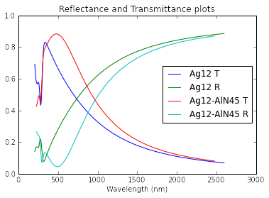
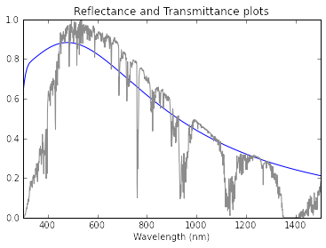
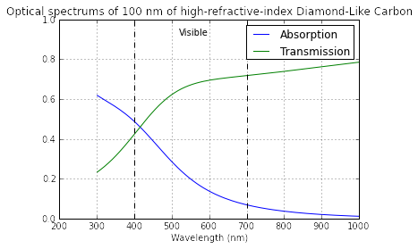
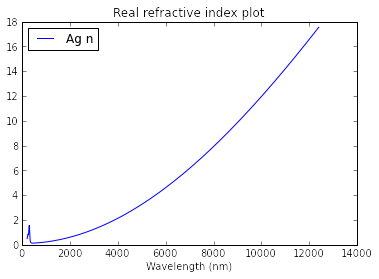
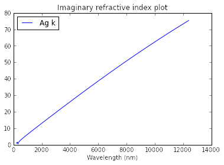
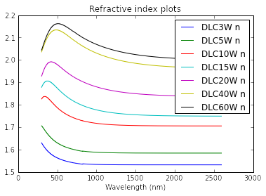
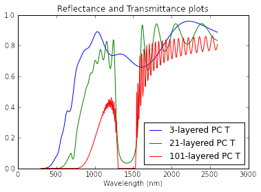
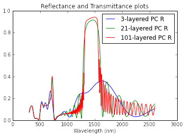

# opt_sim quick start

### Dependecies

- [NumPy](http://www.numpy.org/) (Version 1.6.0 or newer)
- [matplotlib](http://matplotlib.org/)

**Important:** Currently, the cloned library has to be placed in the same directory as the script that calls it.

opt_sim is a library that implements the transfer matrix method to simulate the optical far fields of multilayer thin films. Below are examples of typical usages of the library as well as application of the library to Solar Control Coatings and photonic crystals.

The transfer matrix method characterizes each layer in a multilayer thin film by its thickness and spectral refractive index (nk). We have select materials with their nk values that we use often in the library.


```python
import opt_sim as opt
print opt.nklib.material_list
```

    ['Ag', 'Al', 'AlN', 'BK7', 'DLC3W', 'DLC5W', 'DLC10W', 'DLC15W', 'DLC20W', 'DLC40W',
    'DLC60W', 'DLC80WA', 'ITO', 'PDMS', 'ZnO']
    

Each of the materials is a subclass of the `Layer` class. The `MultiLayer` class is the physical model of the multilayer thin film and is composed of a list of `Layers`. Let's say we want to look at the transmittance of an ultrathin silver film with and without an aluminum nitride antireflection coating. First we initialize the structures.


```python
from opt_sim.structure import MultiLayer as ML
from opt_sim.nklib import *
Ag12 = Ag(12)  # Thickness is the only required input. Default unit is nanometer.
AlN45 = AlN(45)
AgStruct = ML([Ag12])  # Default environment-substrate configuration is air-glass.
AgAlNStruct = ML([Ag12, AlN45])  # Ordered from substrate to environment.
```

To clarify on the structure configuration, a schematic of the structure can be printed in the console.


```python
print AgStruct
print AgAlNStruct
```

    
    Top
    --------
    Ag 12 nm
    --------
    
    
    Top
    ---------
    AlN 45 nm
    ---------
    Ag 12 nm
    ---------
    
    

We can now plot the two structures' transmittance and reflectance curves using `opt.plot.TR`.


```python
%matplotlib inline
# Put structures in a list to plot them in the same window.
opt.plot.TR([AgStruct, AgAlNStruct])
```





Evidently, the structure with an antireflection coating transmits significantly more visible light between 400 nm and 700 nm. Furthermore, the reflective property of silver is shifted toward the infrared beyond 700 nm. This is a simple example of a Solar Control Coating (SCC). SCCs are transparent coatings that reduces temperature indoors passively when applied on windows in the summer (out of its multiple uses). Around half of the sun's energy is in the infrared that, when transmitted, contributes to heat. SCCs reflect off the infrared radiation to keep the interior cool.

Some options are given in `opt.plot.TR`, for example:


```python
opt.plot.TR([AgAlNStruct], curves="T", show_solar=True, legend=False,
            min_wl=300, max_wl=1500)
```





where the background curve is the AM1.5 solar spectrum.

Should we want to manually make our figure using `matplotlib.pyplot`, the far fields have to be calculated with a call explicitly from the `MultiLayer` class first. In `opt.plot.TR`, this was automatically performed.


```python
import matplotlib.pyplot as plt  # Also accessible from opt.plot.plt

DLC_coat = ML([DLC60W(100)])
DLC_coat.calculate_TR()
# DLC_coat now has initialized attributes .T, .R, and .A representing the far fields.

plt.figure()
plt.title("Optical spectrums of 100 nm of high-refractive-index Diamond-Like Carbon")
plt.plot(DLC_coat.wl, DLC_coat.A, label="Absorption")
plt.plot(DLC_coat.wl, DLC_coat.T, label="Transmission")
plt.xlim(200, 1000)
plt.xlabel("Wavelength (nm)")
plt.legend(loc=0)
plt.grid("on")
plt.plot([400, 400], [0, 1], "k--")
plt.plot([700, 700], [0, 1], "k--")
plt.text(520, 0.92, "Visible")
```


    <matplotlib.text.Text at 0x56d0e10>





This thin film has a nonuniform transmittance across the visible, making it coloured. `opt_sim` provides RGB calculation of the coating with the (255, 255, 255) normalization format.


```python
DLC_coat.calculate_color()
print DLC_coat.T_color
```

    (171, 167, 135)
    

Lastly, the refractive index of individual materials can be produced. Shown below is the real and imaginary component of the refractive index of silver.


```python
opt.plot.nk([Ag12], sep=True)  # Shows n and k in separate windows.
```








For fun, let's look at the optical spectrum of photonic crystals. A photonic crystal is composed of a stack of alternating layers with different refractive indices. This type of structure will create passbands and stopbands in the spectrum. Depending on the number of layers, the bands will look either broad or sharp. An ideal photonic crystal will have a spectrum that looks like a step function.

First, we want to select two materials with different refractive indices. And actually, we can make do with just one material if it has variability in its refractive index. Diamond-Like Carbon (DLC) is one of such materials. We can change its refractive index depending on the fabrication parameters. Below is the variation in the real refractive index of DLC.


```python
opt.plot.nk([DLC(1) for DLC in opt.nklib.DLC_list], curves="n")
opt.plot.show()
```





Picking from the different DLC options possible, we create a multilayer with alternating DLC layers, one where the refractive index is low (DLC3W) and one where the refractive index is high (DLC60W). Depending on the number of layers, the spectrum can look drastically different. As shown below, with an increasing number of layers, the spectrum looks sharper and sharper with increasing oscillations. This is the behaviour of a typical photonic crystal.


```python
DLC_L = DLC3W(200)
DLC_H = DLC60W(200)
PC3 = ML([DLC_L, DLC_H] * 3 + [DLC_L], label="3-layered PC")
PC21 = ML([DLC_L, DLC_H] * 10 + [DLC_L], label="21-layered PC")
PC101 = ML([DLC_L, DLC_H] * 50 + [DLC_L], label="101-layered PC")
opt.plot.TR([PC3, PC21, PC101], curves="T")
opt.plot.TR([PC3, PC21, PC101], curves="R")
opt.plot.show()
```








```python

```
